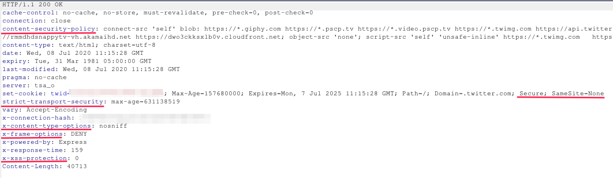
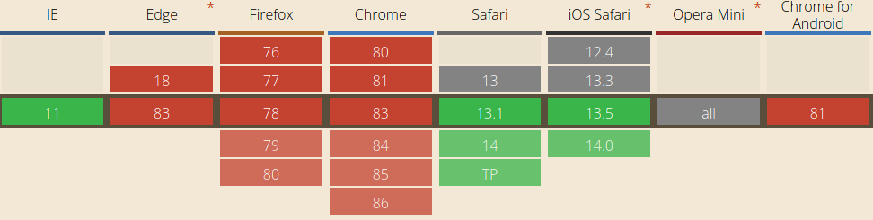
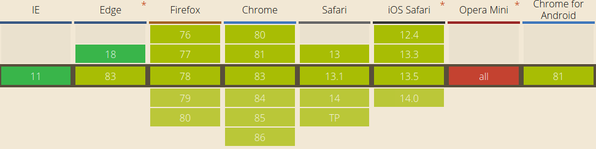
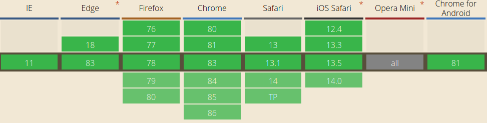
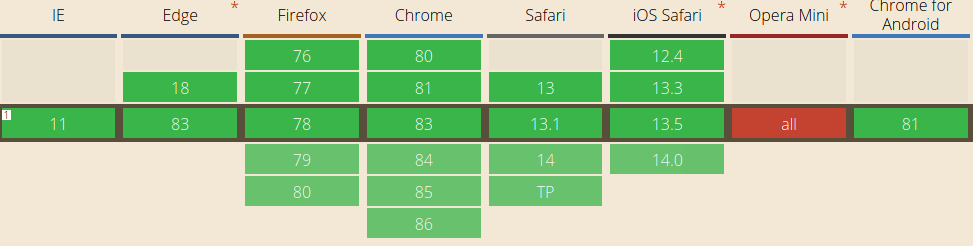
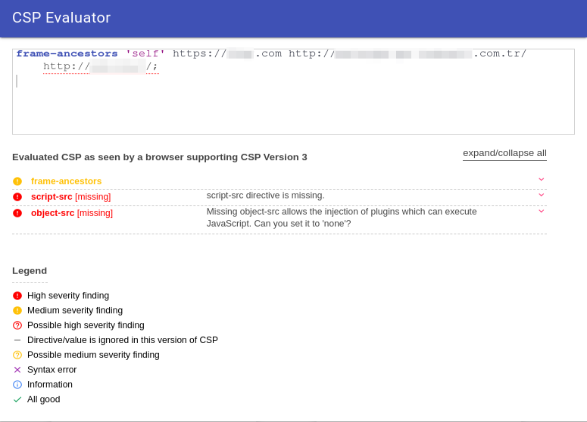
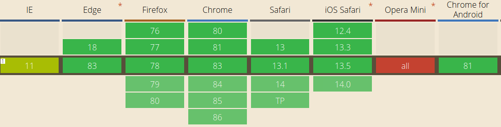
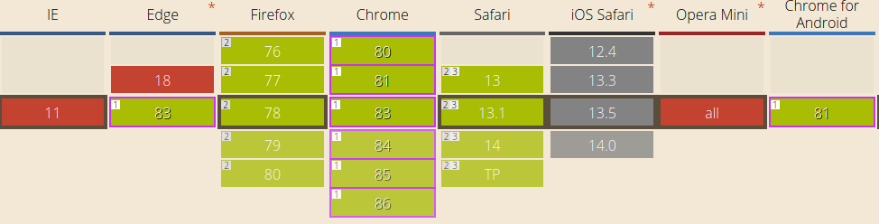
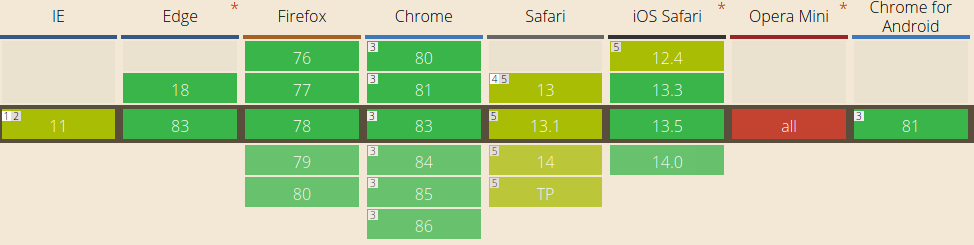

# HTTP SECURITY HEADERS

Hyper Text Transfer Protokol (HTTP), sunucu ve istemci arasında iletişim kurarak hipermedya belgelerinin (HTML) iletimini sağlayan bir protokoldür. İletişim sırasında birtakım veri alışverişleri yapılması gerekir. Sunucu/istemcinin detaylarını, mesajın boyutunu, türünü ve çerezleri içeren bu veriler HTTP başlıkları ile belirtilir.

Aşağıdaki örnekte, Twitter websitesinin kullandığı bazı HTTP başlıklarını görebiliriz.

Yazının devamında, bazı güvenlik zafiyetleri ve bunları engellemeye yardımcı olacak HTTP başlıkları anlatılacaktır.

### X-XSS-PROTECTION

Muhtemel XSS payloadlarını tespit edip filtreleyerek Reflected XSS saldırılarına karşı koruma sağlama amacıyla geliştirildi. Ancak frame buster mekanizmalarını devre dışı bırakmak, sayfadan veri çıkarabilmek gibi bazı güvenlik zafiyetlerine sebep oluyordu (Ayrıntılı bilgi için [bkz](images/https://medium.com/bugbountywriteup/xss-auditor-the-protector-of-unprotected-f900a5e15b7b)). Güncel tarayıcıların çoğunda desteklenmemektedir.

#### XSS nedir?
Cross Site Scripting (XSS), saldırganın kurbanın tarayıcısında keyfi JavaScript kodları çalıştırmasına izin veren bir güvenlik açığıdır.

**Parametreleri**
- **0:**
Filtrelemeyi devre dışı bırakır. 
- **1:**
Filtrelemeyi etkinleştirir.
- **mode=block:**
XSS tespiti halinde sayfanın yüklenmesini engeller. 
- **report=https://website.com/xss.log:**
XSS tespiti halinde saldırı girişimini belirtilen siteye raporlar. Sadece Chromium tabanlı tarayıcılarda kullanılır. 

`X-XSS-Protection: 1; mode=block; report=https://website.com/xss.log`

### X-Frame-Options

Sayfanın bir iframe içerisinde çağırılma durumunu kontrol eder. Clickjacking ve postMessage metodunun sebep olduğu XSS saldırılarına karşı koruma sağlar.

#### Clickjacking nedir?
Clickjacking, saldırganın zararsız gibi görünen bir siteye iframe elementi içerisinde başka bir web sitesi ekleyerek kullanıcıya istemediği işlemler yaptırmasıdır. 
Örneğin, kullanıcı bir hediye kazanacağını düşünerek ekranda gördüğü butona basar. Fakat saldırgan, iframe içerisine bir bankanın para transfer sayfasını koymuşsa kurban butona bastığı anda aslında ödemeyi onaylamış olur. Tarayıcı, bankaya gönderilen isteğe kurbanın çerezlerini de ekler ve saldırgana para transferi gerçekleşir.

#### postMessage XSS nedir?
postMessage; bir websitesinin, içerisindeki iframe ile güvenli bir şekilde iletişim kurmasını sağlayan JavaScript metodudur. Eğer metodun uygulanmasında XSS zafiyetine sebep olacak bir kod yazılmış ise, saldırgan zafiyetli sayfayı kendi websitesinde iframe etiketi içinde açarak XSS saldırısını gerçekleştirebilir.

**Parametreleri**
- **DENY:**
Hiçbir şekilde iframe içerisinde kullanılmasına izin verilmez.
- **SAMEORIGIN:**
Yalnızca aynı domain tarafından kullanılmasına izin verir.
- **ALLOW-FROM URL:**
Yalnızca belirtilen URL tarafından kullanılmasına izin verir. Güncel tarayıcılarda desteklenmemektedir!

`X-Frame-Options: SAMEORIGIN`

### X-Content-Type-Options

Tarayıcının, uygulamanın belirlediği MIME türüne uymasını sağlar. Mime Type Sniffing saldırılarına karşı koruma sağlar.

#### Mime Type Sniffing nedir?
Mime Type Sniffing, Content-Type belirtilmeyen durumlarda tarayıcının belgenin içeriğini analiz ederek belgenin türünü tespit etmeye çalışmasıdır. Bir zafiyet türü değildir fakat XSS gibi bazı saldırılara sebep olabilir. 

Mesela, HTML dosyası yüklemeye izin vermeyen ancak Content-Type belirtmeyen bir uygulamaya HTML ve JS kodları içeren herhangi bir dosya yüklendiğinde, tarayıcı bu dosyayı HTML dosyası olarak kabul eder ve XSS zafiyeti oluşur.

`X-Content-Type-Options: nosniff`

### HSTS (HTTP Strict Transport Security)

Web sitesi ve browser arasındaki iletişimin yalnızca HTTPS üzerinden gerçekleşmesini sağlar. MITM saldırılarına karşı koruma sağlar.

#### Man in The Middle nedir?
MITM saldırıları, bir saldırganın ağ üzerindeki iletişimi dinlemesiyle gerçekleşir. HTTP bağlantılarında paketler şifrelenmediği için, hassas veriler saldırganın eline geçebilir.

**Parametreleri**
- **max-age:** 
Özelliğin browser hafızasında tutulacağı süreyi saniye olarak belirtir.
- **includeSubDomains:** 
Özelliğin tüm subdomainler için geçerli olacağını belirtir.
- **preload:** 
SSL sertifikasının tarayıcıların default HSTS listesine eklenmesini sağlar. Böylece güvenli iletişimin başlaması için, başlığın belirleneceği ilk yanıt beklenmez.

`Strict-Transport-Security: max-age=10886400; includeSubDomains; preload`

### Content-Security-Policy (CSP)

CSP, web sitesi içeriklerinin (JS kodları, CSS dosyaları, görüntüler vs.) hangi kaynaklardan yüklenmesine izin verileceğini ayarlar. XSS, Clickjacking gibi saldırılara karşı koruma sağlar. Google'ın geliştirdiği CSP Evaluator uygulaması ile, websitesinin uyguladığı CSP kurallarını ve bunların olası tehlikelerini görebiliriz.

- **base-uri:** base elementinde kullanılabilecek URL'leri kısıtlar.
- **default-src:** Default değer belirtir.
- **font-src:** @font-face kullanarak yüklenecek kaynakları belirtir.
- **form-action:** Form action olarak kullanılabilecek URL'leri kısıtlar.
- **frame-ancestors:** Sayfayı iframe elementi içerisinde *yükleyebilecek* URL'leri belirtir.
- **frame-src:** Sayfanın içerisinde iframe elementiyle *yüklenebilecek* URL'leri belirtir.
- **img-src:** Resimlerin yüklenebileceği kaynakları belirtir.
- **media-src:** audio, video gibi elementler kullanılarak yüklenecek medyaların kaynaklarını belirtir.
- **object-src:** object, embed, applet gibi elementler kullanılarak yüklenecek objelerin kaynaklarını belirtir. 
- **report-uri:** Belirtilen kuralları ihlal teşebbüsü oluştuğunda, raporun gönderileceği web sitesini belirtir.
- **script-src:** JavaScript kodları için kullanılabilecek kaynakları kısıtlar.
- **style-src:** Stil dosyaları için kullanılabilecek kaynakları kısıtlar.
- **upgrade-insecure-requests:** HTTP isteklerini HTTPS isteklerine çevirir.

* **self:** Yalnızca aynı site üzerinden yüklenmesine izin verir.
* **none:** Hiçbir kaynak üzerinden yüklenmesine izin verilmez.
* ***.website.com:** Belirtilen URL ve subdomainlerinden yükleme yapmaya izin verir.

- Yukarıda sadece bazı özellikler açıklanmıştır. Tüm liste için [bkz.](https://developer.mozilla.org/en-US/docs/Web/HTTP/Headers/Content-Security-Policy#Directives)

`Content-Security-Policy: default-src 'self' https://website.com` 

### Feature Policy

Kamera, mikrofon, sensörlere erişim ve aşağıda belirtilmiş birtakım browser özelliklerinin, sayfanın kendisi ve sayfa içerisindeki iframe elementi tarafından kullanım izinlerini ayarlar.

- **accelerometer:** İvmeölçer sensörünün kullanım iznini belirtir.
- **autoplay:** Medyaların otomatik oynatma özelliğini belirtir.
- **camera:** Kameraya erişim yetkisini belirtir.
- **fullscreen:** Element.requestFullScreen() ögesinin kullanımını denetler.
- **geolocation:** Kullanıcının konumuna erişim yetkisini denetler.
- **microphone:** Mikrofona erişim yetkisini belirtir.
- **picture-in-picture:** Videoların, resim içinde resim özelliği kullanılarak oynatılma iznini denetler.

* **self:** Belirtilen özelliği yalnızca sitenin kendisinin kullanmasına izin verir.
* **none:** Özelliğin kullanımına izin vermez.
* **\***: Özelliğin sitenin kendisi ve yüklediği iframe pencereleri tarafından kullanılmasına izin verir.
* **website.com:** Özelliğin belirtilen websitesi tarafından kullanılmasına izin verir.

Tüm liste için [bkz.](https://developer.mozilla.org/en-US/docs/Web/HTTP/Headers/Feature-Policy#Directives)

`Feature-Policy: camera 'self'; microphone 'none'; autoplay * `

### COOKIE FLAGS

HTTP çerezleri (cookies), kullanıcının tarayıcısında depolanan küçük verilerdir. Genellikle oturum takibi yapmak ve kullanıcının tercihlerini hatırlamak için kullanılır. Bu çerezlerin güvenliğini sağlamak için çerezlere eklenmesi gereken bazı parametreler vardır.

- **HttpOnly:** 
HttpOnly olarak ayarlanmış bir çerez yalnızca sunucuya gönderilir, JavaScript tarafından (document.cookie) erişilemez. Session_id gibi önemli verilerin XSS saldırısıyla ele geçirilmesini engeller.

- **Secure:** 
Çerezlerin yalnızca HTTPS taleplerinde sunucuya gönderilmesini sağlar. HTTPS taleplerinde veriler şifreli olarak gönderildiği için ağı dinleyen saldırganın çerezleri ele geçirmesi önlenir.

- **SameSite:**
Çerezlerin üçüncü taraf isteklerine eklenip eklenmeyeceğini ayarlar.
  - **None:** Çerezlerin bütün üçüncü taraf isteklerine eklenmesine izin verir. `secure` özelliği ile birlikte kullanılmak zorundadır.
  - **Strict:** Çerezlerin hiçbir üçüncü taraf isteğine eklenmesine izin vermez.
  - **Lax:** Çerezleri yalnızca top level bir değişikliğe sebep olacak isteklere ekler. Yani gönderilen istek, sizi halihazırda bulunduğunuz sayfadan başka bir sayfaya götürüyorsa, çerezler isteğe eklenir. GET metodu ve `<a href>` etiketi ile gönderilen istekler buna örnektir. Ajax metodu veya ` <iframe>` etiketleri kullanılarak gönderilen isteklere ise çerezler eklenmez.

`Set-Cookie: sessionid=xAeeEjJyvOA0eCaD1qUFmCT3cfYxc9Tp8q1bonFtoVB10pDCx5GC6iw9I5nY8FXNAWZHEA; HttpOnly; Secure; SameSite=Strict`

**Sonuç olarak,** bu küçük ama etkili önlemleri almak web sitemizin güvenliğini artırabilir, bizi ve kullanıcılarımızı zafiyetlerden koruyabilir.

##### REFERANSLAR

- https://www.mehmetince.net/http-security-headerlari-neden-ve-nasil-kullanilmalidir/
- https://developer.mozilla.org/en-US/docs/*
- https://www.netsparker.com.tr/blog/web-guvenligi/*
- https://nullsweep.com/http-security-headers-a-complete-guide/
