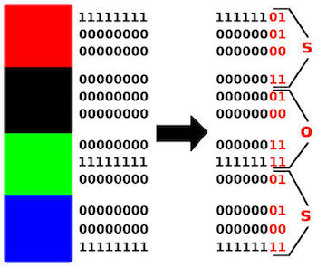
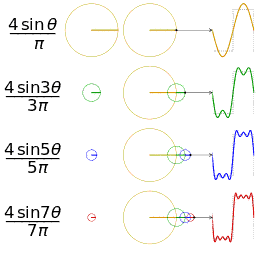

# Steganografi

Steganografi en basit tanımıyla veri gizleme işlemidir. Bu işlemde  temel amaç verinin üçüncü partilerin dikkatini çekmeden mesajı ulaştırmak istenen kişiye iletmektir. 

Çoğunlukla neden kriptografi yerine steganografi kullanmalıyız sorusu sorulmaktadır. Kriptografi yönteminde mesaj şifrelenir ve şifrelenmiş mesajı yalnızca alıcı çözebilir. Asıl amaç bir mesajın içeriğini korumaktır. Ancak bir mesaj şifrelendiğinde şifrelenmiş mesajı gören üçüncü parti kişiler bir mesajın varlığını anlayabilirler, çeşitli tekniklerle mesajı kırmaları mümkün olabilir. Steganografi için temel amaç, alıcı hariç kimselerin mesajın varlığından haberdar olmamasıdır. Yani steganografi methodu görüntüyü herkesin görebileceği ancak mesajın varlığını anlayamayacağı şekilde saklar. Steganografi temel olarak insan bakış açısını sömürmeyi amaçlar.

Ayrıca bazı ülkelerde bulunan şifreleme ve  ifade özgürlüğü kısıtlamaları nedeniyle steganografi yöntemi kullanılmaktadır.

Bu makale boyunca bazı teknik terimler kullanılacaktır. Terminalojiyi bu bölümde açıklayıp makalenin geri kalanında buradaki terimlerden faydalanılacaktır.   

**Cover:** Taşıyıcı dosyadır. Bir görüntü veya ses dosyası olabilir. Bilgi bu dosyaya gizlenir.  
**Payload:** Saklanacak içeriktir.  
**Stego-medium:** Mesaj taşıyıcı dosyaya gömüldükten sonra ortaya çıkan yeni belgedir.  
**Steganaliz:** Steganografi kullanılarak gizlenmiş bilginin saptanmasıdır.  
**Generation:** Saklanacak bilgi için özel taşıyıcı dosya yaratılması işlemidir.  

## Metin Steganografi

Steganografi için dikkat edilmesi gereken bir nokta da mesajın gizleneceği taşıyıcı dosyanın yeteri kadar gereksiz data içermesi gerektiğidir. Metin steganografi yöntemi çok kullanılmamaktadır çünkü metin dosyalarının içinde bilgi gizlenebilecek çok az gereksiz data bulunmaktadır.

Metin steganografi için metnin içindeki tab, boşluk ve satır sonu karakterlerinden yararlanılır, bu karakterlere "Whitespace karakterler" denir. Bu karakterlerin metin görüntüleme programlarındaki görünmezliğinden faydalanılır.

[Whitespace ile steganografi örneği](Return_of_the_Nigerian_Prince)

## Görüntü Steganografi

Görüntü steganografiyi anlamak adına önce görüntünün nasıl çalıştığını anlamak gerekir. Bilgisayar için görüntü, piksellerdeki ışık yoğunluğu ve renk kanallarının  (R,G,B) bir dizi biçiminde ifade edilmesidir.   Görüntü dosyaları  renk derinliklerine göre sınıflandırılır. Renk paletinde kullanılan renk sayısını hesaplamak için bit değerini n olarak kabul edersek, 2ⁿ işlemini kullanabiliriz. 

Örneğin 8-bitlik bir görüntünün 256 farklı renk değeri içerdiğini söyleyebiliriz. Günümüz  görüntü formatında karşımıza sıklıkla 8-bit, 24-bit görüntüler çıkacaktır. 24-bit  görüntülerde 16 milyon renkten daha fazla renk olacağından görüntü steganografide 24-bit format kullanılması insan gözünün saklanan bilgiyi tespit edememesi için mantıklı bir tercihtir. Ancak 24-bit her durum için uygun değildir. Eğer siyah-beyaz, gri tonlarında bir görüntüye steganografi uygulamak istiyorsanız 8-bit görüntü derinliği renk paleti açısından daha uygun olacaktır. 

8-bit görüntü derinliğinin 24-bit  görüntü derinliğine galip geldiği durumlardan bir başkası boyut karşılaştırmasıdır. 24-bit görüntünün içine bir mesaj saklayacaksanız orjinal taşıyıcı dosya ile stego-medium arasındaki boyut farkı daha fazla olacaktır. Yüksek dosya boyutu söz konusu olduğunda aynı zamanda dosya formatları da sıkıştırma metotlarına göre seçilmelidir. JPEG dosyasının sıkıştırma algoritması PNG dosyası sıkıştırma algoritmasına göre daha verimli olduğundan büyük boyutlu stego-medium dosyasını jpeg formatı ile kullanmak daha mantıklıdır.

### Görüntü Steganografi Yöntemleri

#### Least Significant Bit (LSB)

Görüntü dosyasının renk derinliği değerine göre; görüntü, binary bloklarına ayrıldığında en sağdaki bit, binary değerini en az etkileyen bittir. Yöntem adını buradan almaktadır. Bu bit değiştirildiğinde renk değerine etkisi oldukça azdır. Sonuç olarak insan gözü değişikliği fark edemez. 

Bu yöntemin steganalizi için RGB değerlerindeki değişikliğin anlaşılabilmesi adına görüntü filtreleri kullanılabilir. Bu sayede saklanmış bir bilginin varlığı kanıtlandığında araçlar veya basit scriptler kullanılarak LSB değerleri elde edilir. Daha sonra bu değerler binary formattan  mesajın formatına dönüştürüldüğünde işlem tersine alınmış olur. Bu işlemin sonucunda değiştirilen piksellerin renk değerleri de değişir. 

Tespit için renk düzlemleri kullanılır. Bu tespit işlemi için kullanabileceğiniz java ile yazılmış stegsolve aracı oldukça işinize yarayabilir. Stegsolve ve benzeri araçlar incelemek istediğiniz görüntüye renk filtreleri uygulayarak bu görüntünün içinde değiştirilmiş piksellerin görüntülenmesini sağlar. Bu yöntemin işe yaramasının temel nedeni optik prensiplerinden kaynaklanmaktadır. Eğer bir bitin rengi kırmızı baskın olacak şekilde değişmişse ve üzerine kırmızı hariç bir filtre uygulanırsa, kırmızı değer baskınlığı artmış olan bitler siyah görünecektir. Bitin değiştirildiği kanal rengi filtre uygulandığında yalnızca değiştirilen bitler açığa çıkacaktır.

Bu yöntemle değiştirilmiş görüntüler kırpma, görüntü üzerinde oynanma gibi saldırılar karşısında savunmasızdır. Bu tarz ataklar saklanacak verinin kaybolmasına yol açar.

**Örnek:** https://github.com/adrg/lsbsteg/blob/master/lsbsteg.py

#### Filter Masking

Genelde 24-bit görüntüler için kullanılır. Verilen parolaya göre görüntünün içinde modifiye edilecek bitler seçilir. Bazı görüntülerde saklanmış içeriklerin çıkartılmasına yarayan binwalk aracı burada işe yaramayacaktır. Çünkü burada mesajın yazılacağı bitler parola yardımıyla belirlenmiştir.

Görüntünün gri ve kırmızı kanallarındaki bitler modifiye için tercih edilir. Saklanacak  mesajın ASCII formatına dönüştürülmesinin ardından, bit değerleri kontrol edilir. Eğer mesajın bit değeri 0 ise seçilen pikselin değeri değiştirilmez, mesajın bit değeri 1 ise piksel değeri 1 artırılır.

#### Wavelet Steganografi

Piksel değerlerini değiştirerek istenen geliştirme uygulanır. Piksel değerlerini değiştirme işlemleri için logaritmik dönüşümler, kuvvet dönüşümleri, histogram eşitleme gibi yöntemler uygulanır. Bu dönüşümlerle piksellerin doğrudan manipülasyonu sağlanır. Wavelet görüntü steganografi modeli, yüksek ve düşük frekanslı bilginin pixel pixel ayrıştırılmasına dayanmaktadır. Bu yöntemde DWT (Discrete Wavelet Transformation) kullanılmaktadır. Taşıyıcı dosya DWT yoluya ayrıştırılır, payload DWT yoluyla ayrıştırılır. Her birinden elde edilen dört adet frekans katsayısının birleştirilip IDWT(Inverse Discrete Wavelet Transformation) uygulanarak stego-medium haline getirilir. 

## Ses Steganografi

Ses steganografi, görüntü steganografiye göre biraz daha karmaşıktır.  Sinyal işleme, sıkıştırma algoritmaları kullanılmaktadır.  Ses steganografi için oldukça fazla  yöntem bulunmaktadır, bu yazıda bütün yöntemlere değinmek yerine sıkça kullanılan yöntemlerden beş tanesini ele alacağız.

### Ses Steganografi Yöntemleri

#### Least Significant Bit (LSB)

Görüntü steganografide karşımıza çıkan LSB methodu burada da karşımıza çıkmaktadır. Yöntem aynı görüntü steganografide olduğu gibi çalışmaktadır. Benzer şekilde insan kulağının bu kadar küçük frekans değişimlerini algılaması zor olduğundan steganografi işlemi gerçekleşir. Ancak yeterince etkili  bir method değildir. Stego-medium üzerinde değişiklik yapılması halinde veri kaybı yaşanabileceğinden yeterince güvenilir değildir.

**Örnek:** https://github.com/ktekeli/audio-steganography-algorithms/tree/master/03-LSB-Coding

#### Phase Coding

Ses dosyaları yapı olarak incelendiğinde header ve ses verisinden oluştuğu görülür. Bu method için veri saklama işlemi data kısmına yani header bilgilerinin bulunduğu ilk 44 byte'ın sonrasına yapılacaktır. İlk olarak ses datası n segmente ayrılır. Bu segmentlerin her birine DFT (Discrete Fourier Transformation) algoritması uygulanır. Saklanacak mesajımızın binary dosyasındaki değerlere göre faz kayması yapılır. Eğer mesajımızın bit değeri 0 ise ilk fazın artı yönde π/2 kaydırılmasıyla yeni faz oluşturulur. Bit değeri 1 ise ilk faz eksi yönde π/2 kaydırılarak yeni faz oluşturulur. Bu değişiklikler yalnızca ilk segmentte tutulur. Mesaj taşıyıcı dosyaya bu yöntemle eklendikten sonra bütün segmentlere IDFT (Inverse Discrete Fourier Transformation) uygulanır. Bu işlemle ilk segmentin önceki değerine yakın bir değer elde edilir. 

Bütün data ekleme işlemi ilk segmente işlenmiş olduğundan ses dosyasının belli bir yere kadar kırpılmış olması saklanan mesaja zarar vermeyecektir. Aynı zamanda faz değişimi seste  çok belirgin olmayacağından tespit aşamasında spektrum görselleştirme gibi işlemlerden sonuç alınamaz.

**Örnek:** https://github.com/ktekeli/audio-steganography-algorithms/tree/master/04-Phase-Coding

#### Parity Coding

Eşlik biti binary değere eklenen bir bittir. Amacı daha sonra çıkacak hataları kontrol 	etmektir. Binary içindeki 1-bitinin toplam sayısının çift(çift eşlik biti) veya tek(tek 	eşlik biti) olmasına göre eşlik biti 1 ya da 0 değerini alır. 

Sinyal farklı örneklemlere bölünerek gizlenecek mesajın her bitini eşlik bit ile ekler. Eğer örneklemin eşlik biti gizlenecek mesajın biti ile eş değilse, örneklemin LSB değeri değiştirilerek eşitlik sağlanır ve mesaj saklanır.

#### Spread Spectrum

Orijinal ses dosyasının frekansı içinde yeni bir frekans aracılığıya mesaj ekleme methodudur. Frekansların Sonicvisualizer gibi araçlarla renkli bir gösterimde incelerseniz farklı frekansın rengi farklı olacağından farklı frekansı ayırt edebilirsiniz. (Frekans arttıkça mavi, mor gibi yüksek frekanslı renkler;  frekans azaldıkça sarı, turuncu, kırmızı gibi renkler kullanılır. Bu sayede farklı frekanslar görselleştirilir.) 

Bu yöntemin dezavantajlarından birisi; taşıyıcı dosyaya yeni bir frekans eklendiğinde, özellikle  bu frekans 20-20.000 Mhz arağında ise, ses dosyasının içinde duyulabilecek olmasıdır. Ayrıca frekans tüm ses dosyası boyunca eklendiğinden stego-medium dosyası kırma, sıkıştırma gibi işlemlerin ardından bozulmaya uğrayabilir.

**Örnek:** https://github.com/ktekeli/audio-steganography-algorithms/tree/master/01-Spread-Spectrum

#### Echo Data Hiding

1-10 ms gecikme ile saklanacak mesajın bit değerlerinden hareketle taşıyıcı dosyaya yankılar eklenmesidir. Öncelikle ses dosyası segmentlere ayrılır, saklanacak mesajın da bit değerleri alınır. Segmentleri takip edebilmek ve yankısını ekleyebilmek için her bir segmentin hash değerleri alınır. Eğer mesajın bit değeri 1 ise bakılan segmentten üç segment sonrasına aynı segmentin yankısı eklenir,  eğer mesajın bit değeri 0 ise bakılan segmentten iki segment sonrasına aynı segmentin yankısı eklenir.

Bu yöntemin dezavantajı gecikme süresinin uzun olması durumunda verinin varlığının açığa çıkabilir olmasıdır. Ayrıca stego-medium kırpma, sıkıştırma gibi işlemlere karşı savunmasızdır.

**Örnek:** https://github.com/ktekeli/audio-steganography-algorithms/tree/master/02-Echo-Hiding

### Yazarlar
batcain - [github.com/batcain](https://github.com/batcain)  
Bersun - [github.com/rverdoc](https://github.com/Rverdoc)  
Nur Pabuççu - [github.com/nurpabuccu](https://github.com/nurpabuccu)  

### Kaynakça
* Huriye Özdemir, Nisan-Mayıs 2018, "Veri Gizleme Sanatı: Steganography", Arkakapı Dergi 2. Sayı, Sayfa 23-29  
* M. I. Khalil, Ekim 2011, "Image Steganography: Hiding Short Audio Messages Within Digital Images"  
* Sabu M. Thampi, 2004, "Information Hiding Techniques: A Total Review"  
* H.B Kekre - Archana Athawale - Swarnalata Rao - Uttara Athawale, Ekim 2010, "Information Hiding in Audio Signals"  
* P. Jayaram  - H. R. Ranganatha - H. S. Anupama, Ağustos 2011, "Information Hiding Using Audio Steganography - A Survey"   
* Sami Kumar - Gupta Banik - BandyopadhyayBarnali, Haziran 2012, "LSB Modification and Phase Encoding Technique of Audio Steganography Revisited"  
* Jisna Antony - Sobin C. c - Sherly A. p, Ağustos 2012, "Audio Steganography in Wavelet Domain - A Survey"  
* J. Anita Christaline - D. Vaishali, Haziran 2011, "Image Steganographic Techniques With Improved Embedding Capacity And Robustness"  
* Sudhanshi Sharma - Umesh Kumar, 2013, "Review of Transform Domain Techniques of Image Steganography"  
* K. Sharath Reddy, "Audio Steganography: Art of Hiding Secret Message", <https://www.slideshare.net/sharathkanjula1/audio-steganography-sharath>  
* Barış Ceviz, 18 Eylül 2018, "Shazam'ın Müzik Arama Algoritması Nasıl Çalışır?", <http://devnot.com/2018/shazam-in-muzik-arama-algoritmasi-nasil-calisir/>  
* Michael T. Raggo, 2004, "Steganography, Steganalysis & Cryptanalysis"  
* <https://www.blackhat.com/presentations/bh-usa-04/bh-us-04-raggo/bh-us-04-raggo-up.pdf>  
* Neil F. Johnson, <http://www.jjtc.com/index.html>  
* <http://www.georeference.org/doc/images_and_channels.htm>  
* <http://soundfile.sapp.org/doc/WaveFormat/> (WAVE ses formatı için daha detaylı bigileri burada bulabilirsiniz.)
* <https://github.com/ktekeli/audio-steganography/algorithms>
* <https://github.com/adrg/blob/master/lsbsteg.py>
